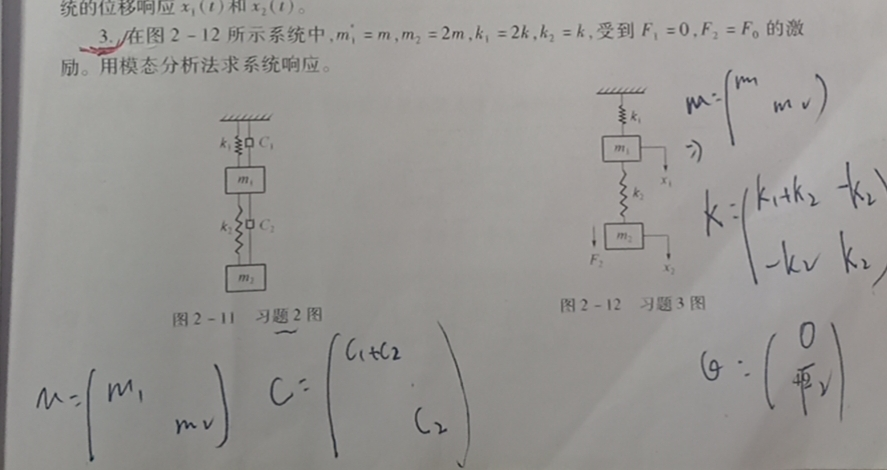

# 这是《机械系统动力学》学习指南

<!-- keywords:key1;key2; -->
<!-- description:this is a description -->
<!-- coverimage: -->
## 课后习题


```matlab
syms k m wn F0 A1 A2
m1=m;m2=2*m;
k1=2*k;k2=k;
F1=0;F2=F0;
F=[F1;F2];
M=diag([m1,m2]);
%振幅列阵
miu=[A1;A2];
K=[k1+k2 -k2;-k2 k2];
%频率方程
s=K-wn^2*M;
%系统的特征矩阵方程
f=s*miu;            %注意这里是两个方程
%pretty((solve(det(s),wn)));   %求系统的固有频率
wn0=(solve(det(s),wn));
wn1=wn0(4);
wn2=wn0(3);

%在固有频率为wn1时，令A1=1；求A2/A1,的到该固有频率下的振型向量miu^(1)=[1,A2/A1]
A2_1=solve(limit(limit(f(1),A1,1),wn,wn1),A2);   %  33^(1/2)/4 + 5/4=   2.6861
%miu1=[1;A2_1];
miu1=[1;2.6861];
%同理求解固有频率为wn2时的振型向量
A2_2=solve(limit(limit(f(1),A1,1),wn,wn2),A2);   %5/4 - 33^(1/2)/4= -0.1861
%miu2=[1;A2_2];
miu2=[1;-0.1861];
%模态矩阵
miu=[miu1 miu2];
```

$系统原方程为[M] \{ {\ddot{X}} \}+[K]\{X\}=\{F\},利用模态矩阵作如下变换$
$$
\begin{cases}\{x\}=[u]\{y\}\\ \{ \ddot{x} \}=[u]\{ \ddot{y}\}  \end{cases}
$$
变换后做左乘$[u]^T$得到

$$
[u]^T[M][u]\{ \ddot{y}\}+[u]^T[K][u]\{ \ddot{y}\}=[u]^T\{F\}\\
[M_0]\{\ddot{y}\}+[K_0]\{y\}=\{Q\}\\ [M_0]=\begin{bmatrix}M1&0\\0&M2  \end{bmatrix}\\
[K_0]=\begin{bmatrix}K1&0\\0&K2 \end{bmatrix}\\
\begin{cases}M_1\ddot{y_1}+K_1y_1=Q_1\\M_2\ddot{y_2}+K_2y_2=Q_2  \end{cases}
$$


```matlab
M0=miu'*M*miu;
K0=miu'*K*miu;
Q=miu'*F;
%求解微分方程
%y1=dsolve('M0(1)*D2y1+K0(1)*y1-Q(1)'','y1(0)=0,Dy1(0)=0','t')  %求解出的结果并未带入数值，不可取
%可用拉氏变换
syms s t
Y1=Q(1)/(s*(M0(1)*s^2+K0(1)));   %解耦后的方程右边求拉氏变换得到Q/s;
Y2=Q(2)/(s*(M0(4)*s^2+K0(4)));
y1=ilaplace(Y1);
y2=ilaplace(Y2);
%将含数字的分式化为小数可用vpa(表达式，n)命令,n表示多少位有效数字
vpa(y1,5);   %(0.55464*F0)/k - (0.55464*F0*cos((0.56023*k^(1/2)*t)/m^(1/2)))/k    
vpa(y2,5);   %(0.054626*F0*cos((1.785*k^(1/2)*t)/m^(1/2)))/k - (0.054626*F0)/k
```

```matlab
pretty(vpa(y1,5))

                   / 0.56023 sqrt(k) t \
             F0 cos| ----------------- | 0.55464
0.55464 F0         \      sqrt(m)      /
---------- - -----------------------------------
     k                        k
     
pretty(vpa(y2,5))

      / 1.785 sqrt(k) t \
F0 cos| --------------- | 0.054626
      \     sqrt(m)     /            0.054626 F0
---------------------------------- - -----------
                 k                        k

```


```matlab
pretty(y1)
%看着不爽

                     / sqrt(64934) sqrt(161431107) sqrt(k) t \
               F0 cos| ------------------------------------- | 268610000
268610000 F0         \            5779126 sqrt(m)            /
------------ - ---------------------------------------------------------
 484293321 k                          484293321 k
```

**$\huge \frac{268610000 F0}{484293321 k}-\frac{cos(\frac{\sqrt{64934\times161431107k}t}{57791226\sqrt{m}})268610000}{484293321k}$**


```matlab
pretty(y2)
%。。。。
     / sqrt(3960246) sqrt(113561107) sqrt(k) t \
F0 cos| --------------------------------------- | 18610000
      \             11880738 sqrt(m)            /            18610000 F0
---------------------------------------------------------- - -----------
                        340683321 k                          340683321 k
```


## 第2章习题 

### 第2题

$\large M=\begin{bmatrix}m_1&0\\0&m_2 \end{bmatrix},K=\begin{bmatrix}k_1+k_2&-k_2\\-k_2&k_2\end{bmatrix},C=\begin{bmatrix}c_1+c_2&-c_2\\-c_2&c_2 \end{bmatrix}$

微分方程为$M\ddot{x}+C\dot{x}+Kx=\{0\},\\即\begin{bmatrix}m_1&0\\0&m_2 \end{bmatrix}\begin{bmatrix}\ddot{x_1}\\\ddot{x_2} \end{bmatrix}+\begin{bmatrix}c_1+c_2&-c_2\\-c_2&c_2 \end{bmatrix}\begin{bmatrix}\dot{x_1}\\ \dot{x_2} \end{bmatrix}+\begin{bmatrix}k_1+k_2&-k_2\\-k_2&k_2\end{bmatrix}\begin{bmatrix}x_1\\x_2\end{bmatrix}=\begin{bmatrix}0\\0\end{bmatrix}$

$\large 令y_1=x_1,y_2=\dot{x_1},y_3=x_2,y_4=\dot{x_2}$

$\begin{bmatrix}\dot{y_1}\\\dot{y_2}\\\dot{y_3}\\\dot{y_4} \end{bmatrix}=A\begin{bmatrix}{y_1}\\{y_2}\\{y_3}\\{y_4} \end{bmatrix}+Bu,输出矩阵\begin{bmatrix}x_{o1}\\x_{o2} \end{bmatrix}=\begin{bmatrix}y_1\\y_3\end{bmatrix}=\begin{bmatrix}1&0&0&0\\0&0&1&0\end{bmatrix}\begin{bmatrix}y_1\\y_2\\y_3\\y_4\end{bmatrix}+\begin{bmatrix}0\\0\end{bmatrix}u$

|             | $y_1$    ($x_1$)       | $y_2  $   ($\dot{x_1}$) | $y_3$   (${x_2}$)  | $y_4$   ($\dot{x_2}$) |
| ----------- | ---------------------- | ----------------------- | ------------------ | --------------------- |
| $\dot{y_1}$ | 0                      | 1                       | 0                  | 0                     |
| $\dot{y_2}$ | $-\frac{k_1+k_2}{m_1}$ | $-\frac{c_1+c_2}{m_1}$  | $\frac{k_2}{m_1}$  | $\frac{c_2}{m_1}$     |
| $\dot{y_3}$ | 0                      | 0                       | 0                  | 1                     |
| $\dot{y_4}$ | $\frac{k_2}{m_2}$      | $\frac{c_2}{m_2}$       | $-\frac{k_2}{m_2}$ | $-\frac{c_2}{m_2}$    |

初始条件：$x_1(0)=0.02,x_2(0)=0.04,\dot{x_1}=\dot{x_2}=0$

即：$y_{10}=0.02,y_{20}=0,y_{30}=0.04,y_{40}=0$    

程序：

```matlab
m1=20;m2=20;k1=1*10^4;k2=1*10^4;
c1=200;c2=0;
A=[0 1 0 0;-(k1+k2)/m1 -(c1+c2)/m1 k2/m1 c2/m1;0 0 0 1;k2/m2 c2/m2 -k2/m2 -c2/m2];
B=[0;0;0;0];
C=[1 0 0 0;0 0 1 0];
D=[0;0];
sys=ss(A,B,C,D);
y0=[0.02;0;0.04;0];
t=[0:0.01:15];
[x_o,t]=initial(sys,y0,t);    %得到x_0=[x_o1 x_o2]
x_o1=[1 0]*x_o';
x_o2=[0 1]*x_o';
subplot(211);
plot(t,x_o1),grid,ylabel('$x_{o1}$','interpreter','latex');
subplot(212);
plot(t,x_o2),grid,ylabel('$x_{o2}$','interpreter','latex'),xlabel('t')
```


**求解非线性方程**    
$\begin{cases}     
\frac{\mathrm{d} x}{\mathrm{d} t} =2x-3y+3z\\\frac{\mathrm{d} y}{\mathrm{d} t}=4x-5y+3z\\\frac{\mathrm{d}z}{\mathrm{d} t} =4x-4y+2z
\end{cases}$  
输入命令：  

```matlab
[x,y,z]=dsolve('Dx=2*x-3*y+3*z,Dy=4*x-5*y+3*z,Dz=4*x-4*y+2*z','t')
```
**用龙格—库塔法求解常微分方程**  

$\begin{cases}
\frac{\mathrm{d}^2 x}{\mathrm{d} t^2}-1000(1-x^2)\frac{\mathrm{d} x}{\mathrm{d} t}-x=0\\x(0)=2,{x}'(0)=0
  \end{cases}
$  
首先用降阶法将原微分方程化为一系列的一阶的微分方程组，编写一个M文件的函数，然后调用函数`ode45`或`ode15s`即可求解出一阶微分方程组的解，调用方法[T,Y]=`ode45`('函数名'，[求解范围]，[初始条件])  
令$y_1=x,y_2=y_1'$ ，则微分方程可变成如下方程组 
$\begin{cases}
  {y_1}'=y_2\\{y_2}'=100(1-y_1^2)y_2-y_1\\y_1(0)=2,y_2(0)=0
\end{cases}$

```matlab
%建立.m文件
function dy=asdf(t,y)
dy=zeros(2,1);
dy(1)=y(2);
dy(2)=100*(1-y(1)^2)*y(2)-y(1);
```
```matlab
[T,Y]=ode45('asdf',[0 3000],[2 0]);%返回的Y=[y1 y2] %或用ode15s()
plot(T,Y(:,1))
hold on
plot(T,Y(:,2))
legend('y_1','y_2','interpreter','latex')
```


**解微分方程**  
$\begin{cases}
  y_1'=y_2y_3\\y_2'=-y_1y_3\\y_3'=-0.51y_1y_2\\y_1(0)=0,y_2(0)=1,y_3(0)=1
\end{cases}$  
```matlab
%建立qwe.m文件
function dy=qwe(t,y)     %t为函数自变量的范围，y为函数的初始值
dy=zores(3,1);
dy(1)=y(2)*y(3);
dy(2)=-y(1)*y(3);
dy(3)=-0.51*y(1)*y(2);
%或直接用dy=[y(2)*y(3);-y(1)*y(3);-0.51*y(1)*y(2)];
```
```matlab
[T,Y]=ode45('qwe' ,[0 15],[0 1 1]);   %T为求解时产生的横坐标的对应值，T-y1,T-y2
plot(T,Y(:,1),'-',T,Y(:,2),'*',T,Y(:,3),'+')
legend('$y_1$','$y_2$','y_3','interpreter','latex')
```
   

**关于状态空间模型的理解**  
状态空间模型一般用于求解多个输入与输出的机械系统，如果用矢量矩阵来表示有  
$\begin{cases}
  \dot{x}=Ax+Bu\\ y=Cx+Du
\end{cases}$  
其中$x=\begin{bmatrix}
  x_1\\x_2\\ \vdots\\x_n
\end{bmatrix},A=\begin{bmatrix}a_{11}&a_{12}& \dots&a_{1n}\\a_{21}&a_{22}&\dots&a_{2n}\\ \vdots&\vdots&\ddots&\vdots\\a_{n1}&a_{n2}&\dots&a_{nn}  \end{bmatrix},\\B=\begin{bmatrix}b_{11}&b_{12}& \dots&b_{1r}\\b_{21}&b_{22}&\dots&b_{2r}\\ \vdots&\vdots&\ddots&\vdots\\b_{n1}&a_{n2}&\dots&a_{nr}  \end{bmatrix},u=\begin{bmatrix}u_1\\u_2\\ \vdots\\u_r \end{bmatrix}...$  
>在状态空间模型中，A为状态矩阵，B为输入矩阵,A和B决定了该系统的模型（确定了系统的微分方程）；C为输出矩阵，D为直接传递矩阵，矢量$\vec{x},\vec{u},\vec{y}$分别为状态矢量，输入矢量和输出矢量，故在求解系统的响应时需要求解什么响应只需改变输出矢量即可，即改变输出矩阵C和直接传递矩阵D即可  


由图可得该系统的状态矢量由$m_1和m_2$的位移和速度组成,输入$f=\alpha u,u是1N的单位阶跃力$,输出矢量为$m_1和m_2的位移$，若需要求输出矢量为速度时，则$y_1=A(1,:)x+D(1,:)u；y_2=A(3,:)x+D(3,:)u，即C_v=[A(1,:);A(3,:)],D_v=[B(1,:);B(3,:)];\\同理加速度的输出矢量对应的输出矩阵和直接传递矩阵为C_a=[A(2,:);A(4,:)];D_a=[B(2,:);B(4,:)$  
现以求系统的阶跃响应为例，代码如下：

```matlab
%求z1和z2
t=0:0.1:200;
A=[0 1 0 0;-9 -2 6 2;0 0 0 1;3 1 -3 -1];
B=[0;0;0;0.5];
C=[1 0 0 0;0 0 1 0];
D=[0;0];
sys=ss(A,B,C,D);
[y,t]=step(sys,t);   %此处注意与龙格-库塔算法作区分，返回的y=[y1;y2]，不对，返回的格式是一样的，仍为两列数据，可以用size(y)来查看，故返回的y是[y1 y2]
y1=[1 0]*y';    %或用y1=y(:,1) or y1=y*[1 0]'
y2=[0 1]*y';
z1=y1;
subplot(211);
plot(t,z1);
grid on
title('z1响应，z2响应');
ylabel('z1/m');
z2=y2;
subplot(212);
plot(t,z2);
grid
xlabel('t/s');
ylabel('z2/m')
```

*仿真结果*
```matlab
%求解m1和m2的速度的仿真结果
C_v=[A(1,:);A(3,:)];
D_v=[B(1,:);B(3,:)];
sys_v=ss(A,B,C_v,D_v);
[v,t0]=step(sys_v,t);
v1=[1 0]*v';
v2=[0 1]*v';
subplot(211);
plot(t0,v1);
title('m1与m2的速度响应');
ylabel('$v_1/ms^{-1}$','interpreter','latex');
grid
subplot(212);
plot(t0,v2);
grid
xlabel('t/s');
ylabel('$v_2/ms^{-1}$','interpreter','latex')
```
  
*运行结果*
```matlab
%求解加速度响应
C_a=[A(2,:);A(4,:)];
D_a=[B(2,:);B(4,:)];
sys_a=ss(A,B,C_a,D_a);
[a,t1]=step(sys_a,t);
a1=[1 0]*a';
a2=[0 1]*a';
subplot(211);
plot(t1,a1);
grid
title('m1和m2的加速度响应');
ylabel('$a_1/m\cdot s^{-2}$','interpreter','latex');
subplot(212);
plot(t1,a2);
grid
xlabel('t/s');
ylabel('$a_2/m\cdot s{-2}$','interpreter','latex')
```
  
*运行结果*  

当求以状态空间形式给出的系统对特定初始条件$x_0$的响应时，matlab可以使用专用命令`[y,t]=initail(sys,x0,t)`命令，其中$x_0$为状态矢量的初始值，t是定义的仿真时间，y是输出矢量  

## 矩阵迭代法

机械系统动力学教材例3-3

python程序

```python
import numpy as np
import sympy as sp
L,E,I,m=sp.symbols('L,E,I,m')
M=np.mat(np.diag([m,m,m]))
a=L**3/(768*E*I)*np.mat([[9,11,7],[11,16,11],[7,11,9]])
miu_0=np.mat([1,2,1]).T
miu_1=np.mat([1,1,1]).T
A=a*M
i=1
print('miu=',miu_0)
print('A=',A)
while(abs(miu_0[1]-miu_1[1])>=1e-6):
    print("第%d次迭代：" %i)
    i+=1
    miu_1=miu_0
    B=A*miu_1
    print('B=',B)
    miu_0=B/B[0]
    print('miu=',miu_0)
    prin()
print('最终结果：')
#B[0,0]=1/(wn^2),B[0]得到的为含中括号的数据，故需要用B[0,0]
wn=(1/B[0,0])**(1/2)   #注意此处不能用np.sqrt()
print('miu=',miu_0)
print('wn=',wn)
```

```python
#运行结果
miu= [[1]
 [2]
 [1]]
A= [[3*L**3*m/(256*E*I) 11*L**3*m/(768*E*I) 7*L**3*m/(768*E*I)]
 [11*L**3*m/(768*E*I) L**3*m/(48*E*I) 11*L**3*m/(768*E*I)]
 [7*L**3*m/(768*E*I) 11*L**3*m/(768*E*I) 3*L**3*m/(256*E*I)]]
第1次迭代：
B= [[19*L**3*m/(384*E*I)]
 [9*L**3*m/(128*E*I)]
 [19*L**3*m/(384*E*I)]]
miu= [[1]
 [27/19]
 [1]]

第2次迭代：
B= [[601*L**3*m/(14592*E*I)]
 [425*L**3*m/(7296*E*I)]
 [601*L**3*m/(14592*E*I)]]
miu= [[1]
 [850/601]
 [1]]

第3次迭代：
B= [[3161*L**3*m/(76928*E*I)]
 [13411*L**3*m/(230784*E*I)]
 [3161*L**3*m/(76928*E*I)]]
miu= [[1]
 [13411/9483]
 [1]]

第4次迭代：
B= [[299249*L**3*m/(7282944*E*I)]
 [211601*L**3*m/(3641472*E*I)]
 [299249*L**3*m/(7282944*E*I)]]
miu= [[1]
 [423202/299249]
 [1]]

第5次迭代：
B= [[4721603*L**3*m/(114911616*E*I)]
 [2225785*L**3*m/(38303872*E*I)]
 [4721603*L**3*m/(114911616*E*I)]]
miu= [[1]
 [6677355/4721603]
 [1]]

最终结果：
miu= [[1]
 [6677355/4721603]
 [1]]
wn= 4.93329665799035*(E*I/(L**3*m))**0.5
```

```matlab
%matlab程序
syms L I E m
M=diag([m,m,m]);
a=L^3/(768*E*I)*[9 11 7;11 16 11;7 11 9];
miu_0=[1 2 1]';
miu_1=[1 1 1]';
A=a*M;
i=1;
while(abs(miu_0(2)-miu_1(2))>10^(-6))
fprintf(['第' num2str(i) '次迭代'])
i=i+1;
miu_1=miu_0;
B=A*miu_1;
%B_str=['B=' num2str(B)]; num2str必须为数值
fprintf(['B=','\n'])
vpa(B)
miu_0=B/B(1);
fprintf(['miu='])
vpa(miu_0)
fprintf('\n')
end
fprintf(['最终结果','\n'])
wn=(1/B(1))^(1/2);
fprintf(['miu='])
vpa(miu_0)
fprintf(['wn='])
vpa(wn)
```

```matlab
第1次迭代B=
 
ans =
 
 (0.049479166666666666666666666666667*L^3*m)/(E*I)
                           (0.0703125*L^3*m)/(E*I)
 (0.049479166666666666666666666666667*L^3*m)/(E*I)
 
miu= 
ans =
 
                               1.0
 1.4210526315789473684210526315789
                               1.0
 

第2次迭代B=
 
ans =
 
 (0.041186951754385964912280701754386*L^3*m)/(E*I)
 (0.058251096491228070175438596491228*L^3*m)/(E*I)
 (0.041186951754385964912280701754386*L^3*m)/(E*I)
 
miu= 
ans =
 
                               1.0
 1.4143094841930116472545757071547
                               1.0
 

第3次迭代B=
 
ans =
 
 (0.041090370216306156405990016638935*L^3*m)/(E*I)
  (0.05811061425402107598447032723239*L^3*m)/(E*I)
 (0.041090370216306156405990016638935*L^3*m)/(E*I)
 
miu= 
ans =
 
                               1.0
 1.4142149108931772645787198144047
                               1.0
 

第4次迭代B=
 
ans =
 
 (0.041089015650813736862455622341734*L^3*m)/(E*I)
 (0.058108643976941193012056662800098*L^3*m)/(E*I)
 (0.041089015650813736862455622341734*L^3*m)/(E*I)
 
miu= 
ans =
 
                               1.0
 1.4142135813319342754695922125053
                               1.0
 

第5次迭代B=
 
ans =
 
 (0.041088996607618850299694680127029*L^3*m)/(E*I)
 (0.058108616277748630738949837760527*L^3*m)/(E*I)
 (0.041088996607618850299694680127029*L^3*m)/(E*I)
 
miu= 
ans =
 
                               1.0
 1.4142135626396374282208817640958
                               1.0
 

最终结果
miu= 
ans =
 
                               1.0
 1.4142135626396374282208817640958
                               1.0
 
wn= 
ans =
 
((24.337415915738786170713632637051*E*I)/(L^3*m))^(1/2)
```

### 机械系统动力学第三章习题

1. 见《振动力学习题精解》p111

2. 

$\huge 均匀分布力的挠曲线方程：y_0=\frac{qx^2}{EI}(x^2+6L^2-4Lx),q=\frac{m_1g}{L}$

$\huge 端部集中力引起的挠曲线方程：y_1=\frac{Fx^2}{6EI}(3L-x),故总的\\ \huge 挠曲线方程为y=y_0+y_1$

$\huge 对悬臂梁，\omega_n^2=\frac{g\sum\limits_{i=1}^nm_iy_i}{\sum\limits_{i=1}^nm_iy_i^2}=\frac{g\sum\limits_{i=1}^n y_i\cdot dm}{\sum\limits_{i=1}^ny_i^2\cdot dm} ,加集中质量后m_2\\ \huge\omega_n^2=\frac{g\sum\limits_{i=1}^n y_i\cdot dm+m_2gy_{max} }{\sum\limits_{i=1}^ny_i^2\cdot dm+m_2y_{max}^2},y_{max}为端部的挠度$

$\huge dm=\rho dx=\frac{m_1}{L}dx,故g\sum\limits_{i=1}^ny_i\cdot dm=g\int_0^L ydm=g\int_0^L\rho y(x)dx$

$\huge \sum\limits_{i=1}^ny^2_i\cdot dm=\int_0^Ly^2(x)dm=\int_0^L\rho y^2(x)dx$

$\huge 故\omega_n^2=\frac{g\int_0^L\rho y(x)dx+m_2gy_{max} } {\int_0^L\rho y^2(x)dx+m_2y_{max} ^2} = g\cdot\frac{\int_0^L\rho y(x)dx+m_2y_{max} }{\int_0^L\rho y^2(x)dx+m_2y_{max} ^2}$

程序：

```matlab
syms m_1 m_2 g L x E I
q=m_1*g/L;
y0=q*x^2*(x^2+6*L^2-4*L*x)/(24*E*I);
F=m_2*g;
y1=F*x^2*(3*L-x)/(6*E*I);
y=y0+y1;
y_max=limit(y,x,L);
rho=m_1/L;
f=g*(int(rho*y,x,0,L)+m_2*y_max)/(int(rho*y^2,0,L)+m_2*y_max^2);
wn=f^(1/2);
pretty(wn)
```

```matlab
%运行结果
  /            /           3                       \          \
    |            |          L  g m_1 (2 m_1 + 5 m_2) |          |
    |          g | m_2 #1 + ------------------------ |          |
    |            \                   40 E I          /          |
sqrt| --------------------------------------------------------- |
    |            6  2             2                          2  |
    |       2   L  g  m_1 (728 m_1  + 3717 m_1 m_2 + 4752 m_2 ) |
    | m_2 #1  + ----------------------------------------------- |
    |                                     2  2                  |
    \                             181440 E  I                   /

where

          3          3
         L  g m_1   L  g m_2
   #1 == -------- + --------
           8 E I      3 E I
```

4. 

```matlab
syms k m wn A1 A2 A3
m1=m;m2=m;m3=m;
k1=k;k2=k;k3=k;
miu=[A1;A2;A3];
K=[k1+k2 -k2 0;-k2 k2+k3 -k3;0 -k3 k3];
M=diag([m1,m2,m3]);
f=K-wn*M; %f=0为频率方程
lf=det(f);  %lf=0为系统的特征方程
s=f*miu;
wn_123=vpa(solve(lf,wn));  %wn^2
```

```matlab
((1.6667*k)/m + ((-(0.4537*k^6)/m^6)^(1/2) + (0.12963*k^3)/m^3)^(1/3) + (0.77778*k^2)/(m^2*((-(0.4537*k^6)/m^6)^(1/2) + (0.12963*k^3)/m^3)^(1/3)))^(1/2)
((1.6667*k)/m - ((-(0.4537*k^6)/m^6)^(1/2) + (0.12963*k^3)/m^3)^(1/3)*(0.5 + 0.86603i) + (k^2*(- 0.38889 + 0.67358i))/(m^2*((-(0.4537*k^6)/m^6)^(1/2) + (0.12963*k^3)/m^3)^(1/3)))^(1/2)
((1.6667*k)/m - ((-(0.4537*k^6)/m^6)^(1/2) + (0.12963*k^3)/m^3)^(1/3)*(0.5 - 0.86603i) + (k^2*(- 0.38889 - 0.67358i))/(m^2*((-(0.4537*k^6)/m^6)^(1/2) + (0.12963*k^3)/m^3)^(1/3)))^(1/2)
```

```matlab
wn1=wn_123(4);
wn2=wn_123(5);
wn3=wn_123(6);
s1=limit(limit(s,wn,wn1),A1,1);
[a2 a3]=solve(s1(2),s1(3),A2,A3)   %a2=A2,a3=A3,[a2 a3]里面不能有逗号
```

有毒，全是字母，没意思

例题3-8

```matlab
syms wn2 A1 A2 A3
M=diag([3 1 2]);
miu=[A1 A2 A3]';
K=[140 -60 -20;-60 220 -80;-20 -80 200];
f=K-wn2*M;
x=f*miu;
w_123=solve(det(f),wn2);   %求得wn^2
w1=w_123(2);
w2=w_123(1);
w3=w_123(3);
xx=limit(limit(x,wn2,w1),A1,1);
[a2 a3]=solve(xx(1),xx(2),A2,A3);
miu1=[1 a2 a3]';
xx1=limit(limit(x,wn2,w2),A1,1);
[a_22 a_23]=solve(xx1(1),xx1(2),A2,A3);
miu2=[1 a_22 a_23]';
xx2=limit(limit(x,wn2,w3),A1,1);
[a_32 a_33]=solve(xx2(1),xx2(2),A2,A3);
miu3=[1 a_32 a_33]';
miu_=[miu1 miu2 miu3];
vpa(miu_,4)
```
## python控制系统建模
```python
from control import *
import sympy as sp
import matplotlib.pyplot as plt
from sympy import pprint
a=tf([1],[1,2,3])
b=ss(a)
pprint(a)
pprint(b)
[t,y]=step_response(a)
plt.show()
plt.show()
```


```python
         1   
-------------
s^2 + 2 s + 3
A = [[-2. -3.]
     [ 1.  0.]]
               
   B = [[1.]   
        [0.]]  
               
 C = [[0. 1.]] 
               
   D = [[0.]]  
```

