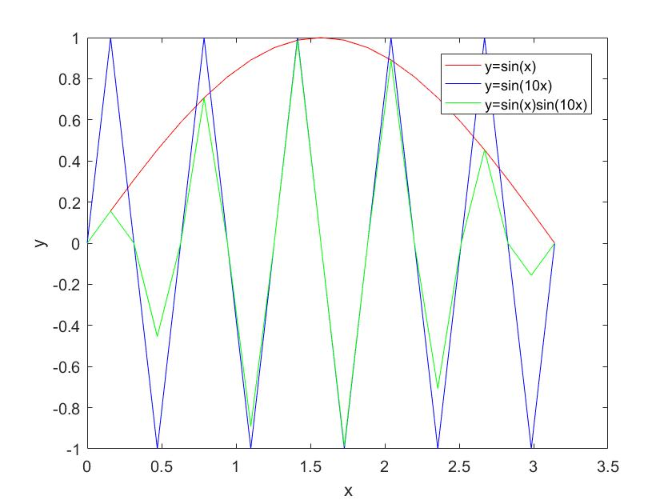

# 这是matlab学习指南


[混沌动力系统中的吸引子](https://www.bilibili.com/video/BV1TN411Z79N?share_source=copy_web)

<iframe  src="//player.bilibili.com/player.html?aid=503174658&bvid=BV1TN411Z79N&cid=342961984&page=1" scrolling="no" border="0" frameborder="no" framespacing="0" allowfullscreen="true" width="800" height="537" bui-switch-input="true" ></iframe>


欲读取图片需将图片放入工作目录中直接输入文件名即可


<!-- keywords:kssey1;kessy2; -->
<!-- description:this is a description -->
<!-- coverimage: -->
# matlab控制系统仿真与应用
[TOC]
## 第一章 MATLAB应用基础
1. 元素的提取  
A(i,j);  
A(i,:);  
A(:,j);  
A(i1:i2,:)；  
A(:,j1:j2)  
只有以上的表达方式是正确的，错误的表达方式有  
$A(rstart:,vstart:)$  
$A(:rend,:vend)$  
$A(rstart: ,:)$
...
2. 特殊矩阵的生成  
eye(n)  
eye(n,m)  
zeros()  
diag(V,K),V为向量，K为数值，K>0,元素在主对角线上方，V<0,元素在主对角线下方，V=0,在主对角线上  
ones()  
3. 数值运算  
```matlab
dot(a,b)      %向量点积
cross(a,b)    %向量叉积
A./B          %点右除
A.\B          %点左除
A.^n          %点乘方
```
4. 矩阵运算  
   
| 函数名 | 功能     | 函数名 | 功能               |
|--------|--------|--------|------------------|
| det    | 求行列式 | eig    | 求特征值与特征向量 |
| inv    | 矩阵求逆 | poly   | 求特征多项式       |
| rank   | 求秩     | trace  | 求迹               |

5. 多项式运算  
$p=[a_0,a_1,...,a_n],r=root(p),多项式求根$  
$[r,p,k]=residue(num,den),多项式部分分式展开$  
$P=poly(a),由根a构造特征多项式$
 6. 绘图操作  
图像注释：title('标题头内容')，xlabel(''),ylabel('')
legend('','')  
7. 特殊坐标绘图  

$loglog(x,y)$ 

$polar(theta,rho,'s'),s的用法与plot里的用法一致$

$plotty(x,y1,x,y2),双纵坐标绘图$ 

$plot3(x,y,z，'s'),三维曲线的绘制$

$mesh(x,y,z),三维曲面网线绘图$

$[x,y]=meshgrid(a : b : c),生成绘制三维曲线的坐标矩阵数据$

$surf(x,y,z),绘制三维表面图形$

$fill(x,y,'c')  用颜色填充二位图形y=f(x)$ ,参数c为具体颜色

$title('string')  在当前图形放置字符串string作为标题$

$text(x,y,'string') 在指定位置（x,y)上显示字符串string$
8. 一些与微积分有关的MATLAB符号运算指令  

|指令|说明 |
---|---
symsum(S,x,z,b)|对通项S求和，且x从a到b
limit(F,x,a)|求极限
solve（P，x)|解方程
diff(S,x,n)|求表达式对变量x的n阶导数
dsolve(a)|求解微分方程
int(F,x,a,b)|求定积分

**例题1**   
求计数S=$\sum\limits_{n=1}^{\infty}\frac{n}{2^n}$的和及前五项的和。
```matlab
clear
syms n;
symsun(n/(2^n),n,1,inf)%级数和
symsun(n/(2^n),n,1,5)  %前5项和
```
**例题2**  
求一元二次方程$ax^2+bx+c=0$的根
```matlab
syms x a b c
solve(a*x^2+b*x+c,x)
```
**例题3**  
求微分方程${y}''+2{y}'-3y=e^{-t}$,初值条件$y|_{t=0}=0,{y}'|_{t=0}=1$的解  
```matlab
syms y t;
y=dsolve('D2y+2*Dy-3*y=exp(-t)','y(0)=0,Dy(0)=1','t')
```
**求解非线性方程**    
$\begin{cases}     
\frac{\mathrm{d} x}{\mathrm{d} t} =2x-3y+3z\\\frac{\mathrm{d} y}{\mathrm{d} t}=4x-5y+3z\\\frac{\mathrm{d}z}{\mathrm{d} t} =4x-4y+2z
\end{cases}$  
输入命令：  
```matlab
[x,y,z]=dsolve('Dx=2*x-3*y+3*z,Dy=4*x-5*y+3*z,Dz=4*x-4*y+2*z','t')
```
**用龙格—库塔法求解常微分方程**  

$\begin{cases}
\frac{\mathrm{d}^2 x}{\mathrm{d} t^2}-1000(1-x^2)\frac{\mathrm{d} x}{\mathrm{d} t}-x=0\\x(0)=2,{x}'(0)=0
  \end{cases}
$  
首先用降阶法将原微分方程化为一系列的一阶的微分方程组，编写一个M文件的函数，然后调用函数ode45或ode15s即可求解出一阶微分方程组的解，调用方法[T,Y]=ode45('函数名'，[求解范围]，[初始条件])  
令$y_1=x,y_2=y_1'$ ，则微分方程可变成如下方程组 
$\begin{cases}
  {y_1}'=y_2\\{y_2}'=100(1-y_1^2)y_2-y_1\\y_1(0)=2,y_2(0)=0
\end{cases}$
```matlab
%建立.m文件
function dy=asdf(t,y)
dy=zeros(2,1);
dy(1)=y(2);
dy(2)=100*(1-y(1)^2)*y(2)-y(1);
```
```matlab
[T,Y]=ode45('asdf',[0 3000],[2 0]);%返回的Y=[y1 y2] %或用ode15s()
plot(T,Y(:,1))
hold on
plot(T,Y(:,2))
legend('y_1','y_2','interpreter','latex')
```


**解微分方程**  
$\begin{cases}
  y_1'=y_2y_3\\y_2'=-y_1y_3\\y_3'=-0.51y_1y_2\\y_1(0)=0,y_2(0)=1,y_3(0)=1
\end{cases}$  
```matlab
%建立qwe.m文件
function dy=qwe(t,y)     %t为函数自变量的范围，y为函数的初始值
dy=zores(3,1);
dy(1)=y(2)*y(3);
dy(2)=-y(1)*y(3);
dy(3)=-0.51*y(1)*y(2);
%或直接用dy=[y(2)*y(3);-y(1)*y(3);-0.51*y(1)*y(2)];
```
```matlab
[T,Y]=ode45('qwe' ,[0 15],[0 1 1]);   %T为求解时产生的横坐标的对应值，T-y1,T-y2
plot(T,Y(:,1),'-',T,Y(:,2),'*',T,Y(:,3),'+')
legend('$y_1$','$y_2$','y_3','interpreter','latex')
```
   

**关于状态空间模型的理解**  
状态空间模型一般用于求解多个输入与输出的机械系统，如果用矢量矩阵来表示有  
$\begin{cases}
  \dot{x}=Ax+Bu\\ y=Cx+Du
\end{cases}$  
其中$x=\begin{bmatrix}
  x_1\\x_2\\ \vdots\\x_n
\end{bmatrix},A=\begin{bmatrix}a_{11}&a_{12}& \dots&a_{1n}\\a_{21}&a_{22}&\dots&a_{2n}\\ \vdots&\vdots&\ddots&\vdots\\a_{n1}&a_{n2}&\dots&a_{nn}  \end{bmatrix},\\B=\begin{bmatrix}b_{11}&b_{12}& \dots&b_{1r}\\b_{21}&b_{22}&\dots&b_{2r}\\ \vdots&\vdots&\ddots&\vdots\\b_{n1}&a_{n2}&\dots&a_{nr}  \end{bmatrix},u=\begin{bmatrix}u_1\\u_2\\ \vdots\\u_r \end{bmatrix}...$  
>在状态空间模型中，A为状态矩阵，B为输入矩阵,A和B决定了该系统的模型（确定了系统的微分方程）；C为输出矩阵，D为直接传递矩阵，矢量$\vec{x},\vec{u},\vec{y}$分别为状态矢量，输入矢量和输出矢量，故在求解系统的响应时需要求解什么响应只需改变输出矢量即可，即改变输出矩阵C和直接传递矩阵D即可  


由图可得该系统的状态矢量由$m_1和m_2$的位移和速度组成,输入$f=\alpha u,u是1N的单位阶跃力$,输出矢量为$m_1和m_2的位移$，若需要求输出矢量为速度时，则$y_1=A(1,:)x+D(1,:)u；y_2=A(3,:)x+D(3,:)u，即C_v=[A(1,:);A(3,:)],D_v=[B(1,:);B(3,:)];同理加速度的输出矢量对应的输出矩阵和直接传递矩阵为C_a=[A(2,:);A(4,:)];D_a=[B(2,:);B(4,:)$  
现以求系统的阶跃响应为例，代码如下：
```matlab
%求z1和z2
t=0:0.1:200;
A=[0 1 0 0;-9 -2 6 2;0 0 0 1;3 1 -3 -1];
B=[0;0;0;0.5];
C=[1 0 0 0;0 0 1 0];
D=[0;0];
sys=ss(A,B,C,D);
[y,t]=step(sys,t);   %此处注意与龙格-库塔算法作区分，返回的y=[y1;y2]
y1=[1 0]*y';
y2=[0 1]*y';
z1=y1;
subplot(211);
plot(t,z1);
grid on
title('z1响应，z2响应');
ylabel('z1/m');
z2=y2;
subplot(212);
plot(t,z2);
grid
xlabel('t/s');
ylabel('z2/m')
```

*仿真结果*
```matlab
%求解m1和m2的速度的仿真结果
C_v=[A(1,:);A(3,:)];
D_v=[B(1,:);B(3,:)];
sys_v=ss(A,B,C_v,D_v);
[v,t0]=step(sys_v,t);
v1=[1 0]*v';
v2=[0 1]*v';
subplot(211);
plot(t0,v1);
title('m1与m2的速度响应');
ylabel('$v_1/ms^{-1}$','interpreter','latex');
grid
subplot(212);
plot(t0,v2);
grid
xlabel('t/s');
ylabel('$v_2/ms^{-1}$','interpreter','latex')
```
  
*运行结果*
```matlab
%求解加速度响应
C_a=[A(2,:);A(4,:)];
D_a=[B(2,:);B(4,:)];
sys_a=ss(A,B,C_a,D_a);
[a,t1]=step(sys_a,t);
a1=[1 0]*a';
a2=[0 1]*a';
subplot(211);
plot(t1,a1);
grid
title('m1和m2的加速度响应');
ylabel('$a_1/m\cdot s^{-2}$','interpreter','latex');
subplot(212);
plot(t1,a2);
grid
xlabel('t/s');
ylabel('$a_2/m\cdot s{-2}$','interpreter','latex')
```
  
*运行结果*  

当求以状态空间形式给出的系统对特定初始条件$x_0$的响应时，matlab可以使用专用命令`[y,t]=initail(sys,x0,t)`命令，其中$x_0$为状态矢量的初始值，t是定义的仿真时间，y是输出矢量  
## 习题1

- 1.3
$C=A*B$,$D=C(4:5,3:5)$  
- 1.4,有错
- 1.5，[m,n]=eig(A),或者用solve(det-x*eye(3))求特征值
- 1.7
  ```matlab
  x=0:pi/20:pi;
  y1=sin(x);
  y2=sin(10*x);
  y12=y1.*y2;
  plot(x,y1,'r-',x,y2,'b-',x,y12,'g-')
  xlabel('x'),ylabel('y')
  legend('y=sin(x)','y=sin(10x)','y=sin(x)sin(10x)')
  ```
运行结果  

  
  *图像失真，sin(10x)的周期为T=$\frac{2\pi}{10},即\frac{\pi}{5}$,而采样周期为$\frac{\pi}{20}$,相当于一个周期内只采了4个点，故图像失真，呈现锯齿状，现将程序作如下改动：*
  
  ```matlab
  syms x
  t=[-6,6];
  y1=sin(x);
  y2=sin(10*x);
  y12=y1.*y2;
  ezplot(x,y1,t)
  hold on
  ezplot(x,y2,t)
  hold on
  ezplot(x,y12,t)
  axis([-6 6 -2 2])
  grid
  hold off
  xlabel('x'),ylabel('y'),title('')
  legend('y=sin(x)','y=sin(10x)','y=sin(x)sin(10x)')
  ```

   
- 1.8，画分段函数  

$p(x,y)=\begin{cases}
  0.5400e^{-0.75x^2-3.75y^2-1.5y}
  & \text{ , } x+y>1 \\
  0.7575e^{-x^2-6y^2}
  & \text{ , } -1<{x+y}\le1 \\
  0.5457e^{-0.75x^2-3.75y^2+1.5y}
  & \text{ , } x+y\le-1
\end{cases}$  

代码

```matlab
[x,y]=meshgrid(-10:0.1:10);
t=x+y;
[m,n]=size(t);   %获取矩阵t的行数与列数
p=zeros(m,n);
for i=1:1:m
for j=1:1:n
if t(i,j)>1
p(i,j)=0.54*exp(-0.75*x(i,j)^2-3.75*y(i,j)^2-1.5*y(i,j));
elseif t(i,j)>-1 && t(i,j)<=1
p(i,j)=0.7575*exp(-x(i,j)^2-6*y(i,j)^2);
else
p(i,j)=0.5457*exp(-0.75*x(i,j)^2-3.75*y(i,j)^2+1.5*y(i,j));
end
end
end
surf(x,y,z)
图形效果如下
```


- 1.9

```matlab
t=0:pi/20:8*pi;
r=2*t;
polar(t,r,'bp')
```

...
## 习题2
- 2.1  

(1) 

```matlab
num=[1 4 3 2];
a=[1 0 0 ];b=[1 1];
c=conv([1 4],[1 4]);
c(length(c))=c(length(c))+4;
den=conv(conv(a,b),c);
c                        %c=[1 8 20]
G_s=tf(num,den)
```
$$运行结果 G_s=\frac{s^3 + 4 s^2 + 3 s + 2}{s^5 + 9 s^4 + 28 s^3 + 20 s^2}$$

(2)
```matlab
A=[-0.3 0.1 -0.05;1 0.1 0;-1.5 -8.9 -0.05];
B=[2;0;4];
C=[1 2 3];
D=0;
sys=ss(A,B,C,D)
```

运行结果
sys=  
A=

|    | x1   | x2   | x3    |
|----|------|------|-------|
| x1 | -0.3 | 0.1  | -0.05 |
| x2 | 1    | 0.1  | 0     |
| x3 | -1.5 | -8.9 | -0.05 |

B =

|    | u1 |
|----|----|
| x1 | 2  |
| x2 | 0  |
| x3 | 4  |

C =   

|    | x1 | x2 | x3 |
|----|----|----|----|
| y1 | 1  | 2  | 3  |

D = 

|    | u1 |
|----|----|
| y1 | 0  |


- 2.2

```matlab
%%(1)
GH_s=feedback(G_s,1);
[z0,p0,k0]=zpkdata(G_s)  %开环传递函数的零极点
[z,p,k]=zpkdata(GH_s,'v')%v表示数值可视化
```

(1)的另外一种求法
```matlab
[z,p,k]=tf2zp(num,den)
```

```matlab
%%(2)
Gsys=feedback(sys,1);%闭环模型
zpkdata(sys,'v')
zpkdata(Gsys,'v')
```
(2)的另一种解法
```matlab
[z p k]=ss2zp(A,B,C,D)
```
- 2.3

```matlab
A=[1 2 3;4 5 6;7 8 0];
B=[4;3;2];
C=[1 2 3];
D=0;
G=tf(ss(A,B,C,D))
zpkdata(G,'v')%返回零极点
```

$$ 运行结果: G=\frac{16s^2+ 162s+108}{s^3-6s^2-72s-27} $$

$ans =-9.4075、-0.7175$

- 2.4
```matlab
num=[2 18 40];
den=[1 6 11 6];
zpksys=zpk(tf(num,den))
ss_sys=ss(tf(num,den))
```
运行结果  

$$
zpksys =
\frac{2(s+5)(s+4)}
  {(s+3)(s+2)(s+1)}
  $$  

状态空间模型略

- 2.5
```matlab
z=[-4 -5];
p=[-1 -2 -3];
k=2;
tf_m=tf(zpk(z,p,k))
ss_m=ss(zpk(z,p,k))
```
得到的tf模型  
$$tf_m =\frac{2 s^2 + 18 s + 40}{
  s^3 + 6 s^2 + 11 s + 6}$$
- 2.6
```matlab
A=[0 1 0 0;0 0 1 0;0 0 0 1;-50 -48 -28.5 -9];
B=[0;0;0;1];
C=[10 2 0 0];
D=0;
tf_m=tf(ss(A,B,C,D))
zpk_m=zpk(ss(A,B,C,D))%求出zpk模型自然得到零极点
%或用[z,p]=zpkdata(zpk_m,'v')求
pzmap(zpk_m)%绘制零极点图
```
运行结果

tf_m =$$\frac{2s + 10}{s^4 + 9s^3 + 28.5s^2 + 48 s + 50}$$

zpk_m=$$\frac{2 (s+5)}{(s+4.458) (s+3.042) (s^2 + 1.5s + 3.687)}$$


*零极点图*   
图中o表示零点，x表示极点

- 2.7
```matlab
G_1=tf([2 6 5],[1 4 5 2]);
G_2=tf([1 4 1],[1 9 8 0]);
G_3=zpk([-3 -7],[-1 -4 -6],5)
G=series(series(G_1,G_2),G_3)%或G=G_1*G_2*G_3
```
运行结果  
$$G =\frac{10 (s+3) (s+3.732) (s+7) (s+0.2679) (s^2 + 3s + 2.5)}{s (s+1)^4 (s+2) (s+4) (s+6) (s+8)}$$

- 2.8  
```matlab
G1=zpk(-3,[-1 -1 -2],1) %避免打错可不加分号，一遍随时检查自己是否错误输入
G2=tf([3 1 4],[5 12 3])
G=parallel(G1,G2)       %或用G=G1+G2
```
运行结果  

$$G=\frac{0.6(s+0.3913) (s^2 + 3.896s + 3.819) (s^2 + 0.04608s + 3.793)} {(s+1)^2 (s+2) (s+2.117) (s+0.2835)}$$
- 2.9  题目读不懂，略
- 2.10 由方框图可知，该控制系统一个正反馈，一个负反馈，一个串联连接  
```matlab
G1=tf(10,[1 1]);
G2=zpk([],[0 -1],2);%注意此次无零点，故z=[]
H_plus=tf([1 2],[1 3]);
H_minus=tf([5 0],[1 6 8]);
G2H_p=feedback(G2,H_plus,+1);%正反馈部分
G12H_p=series(G1,G2H_p);%G12H_p=G1*G2H_p
G_s=feedback(G12H_p,H_minus)
运行结果：
```
G_s=$$\frac{20 (s+3) (s+4) (s+2)}{(s+2.986) (s-0.1198) (s^2 - 0.8664s + 3.707) (s^2 + 9s + 24.13)
 }$$

- 2.11  
系统有$G_1(s)$与$G_2(s)$串联而成，已知  
$$
G_1(s)=\frac{s+1}{s^2+3s+4},G_2(s)=\frac{s^2+3s+5}{s^4+4s^3+3s^2+2s+1}
$$

求总系统的状态方程模型，比较一下两种方法得到的结果  
（1）将两者的传递函数模型进行串联连接，求出整个系统的状态方程  
（2）求出两个模型的状态方程，然后求整个系统的状态方程模型  

```matlab
%(1)
G1=tf([1 1],[1 3 4]);
G2=tf([1 3 5],[1 4 3 2 1]);
G=G1*G2;
ss(G)
```
运行结果：  
A=

|    | x1 |   x2   |   x3   |   x4    |   x5    |  x6   |
|----|:--:|:------:|:------:|:-------:|:-------:|:-----:|
| x1 | -7 | -1.688 | -2.375 | -0.5938 | -0.3438 | -0.25 |
| x2 | 8  |   0    |   0    |    0    |    0    |   0   |
| x3 | 0  |   2    |   0    |    0    |    0    |   0   |
| x4 | 0  |   0    |   2    |    0    |    0    |   0   |
| x5 | 0  |   0    |   0    |    1    |    0    |   0   |
| x6 | 0  |   0    |   0    |    0    |   0.5   |   0   |

B=   

|    | u1 |
|----|----|
| u1 |    |
| x1 | 1  |
| x2 | 0  |
| x3 | 0  |
| x4 | 0  |
| x5 | 0  |
| x6 | 0  |

C=  

|    | x1 | x2 | x3     | x4    | x5   | x6     |
|----|----|----|--------|-------|------|--------|
| y1 | 0  | 0  | 0.0625 | 0.125 | 0.25 | 0.3125 |

D=  

D = 

|    | u1 |
|----|----|
| y1 | 0  |

```matlab
ss1_m=ss(G1);
ss2_m=ss(G2);
ss12=series(ss1_m,ss2_m)
```
运行结果  
ss12=  
A = 

|    | x1 | x2   | x3 | x4   | x5 | x6 |
|----|----|------|----|------|----|----|
| x1 | -4 | -1.5 | -1 | -0.5 | 2  | 1  |
| x2 | 2  | 0    | 0  | 0    | 0  | 0  |
| x3 | 0  | 1    | 0  | 0    | 0  | 0  |
| x4 | 0  | 0    | 1  | 0    | 0  | 0  |
| x5 | 0  | 0    | 0  | 0    | -3 | -2 |
| x6 | 0  | 0    | 0  | 0    | 2  | 0  |

B = 

|    | u1 |
|----|----|
| x1 | 0  |
| x3 | 0  |
| x4 | 0  |
| x5 | 1  |
| x6 | 0  |

C = 

|   | x1|    x2|    x3|    x4|    x5|    x6|
---|---|---|---|---|---|---
 y1|     0|  0.25|  0.75|  1.25|     0     |0  

D = 

|   |u1|
---|---
 y1|   0

- 2.12  
```matlab
G1=[tf([1 2],[1 2 1]),tf([1],[1 3 2]);tf([1 1],[1 2]),tf([1 2],[1 5 6])];
G2=[zpk([],[-1 -3],1.2) zpk(-1,[-2 -3],1);zpk(-1,[-2 -4],1) zpk(-2,[-3 -4],1)];
G_a=series(G1,G2)
G_b=parallel(G1,G2)
```
运行结果  
G_a =

  From input 1 to output...  
 1: $$\frac{(s+1.599) (s+3) (s^2 + 3.219s + 2.857) (s^2 + 0.1815s + 2.32)}{ (s+1)^3 (s+2)^2 (s+3)^2}$$   

 2:$$\frac{(s+2)^2 (s+1) (s+4) (s^2 + 3s + 4)}{         (s+2)^2 (s+3) (s+4)^2 (s+1)^2
}$$  
  From input 2 to output...  
      
 1:$$\frac{(s+2)^2 (s+2.046) (s+3) (s^2 + 0.9539s + 2.248)}{(s+1)^2 (s+2)^3 (s+3)^3}$$  

 2:$$\frac{ (s+1) (s+2) (s+2.57) (s+4) (s^2 + 4.43s + 6.615)}{(s+2)^3 (s+3)^2 (s+4)^2 (s+1)}$$  

G_b =

  From input 1 to output...   
    
 1:$$\frac{(s+1.548) (s+1) (s+4.652)}{ (s+1)^3 (s+3)}$$  

 2:$$\frac{(s+5) (s+2) (s+1)}{(s+2)^2 (s+4)}$$  

  From input 2 to output...  

 1: $$\frac{(s+2) (s^2 + 3s + 4)}{ (s+2)^2 (s+3) (s+1)}$$  

 2: $$\frac{ 2 (s+2) (s+3)^2}{(s+3)^2 (s+4) (s+2)}$$   

## 习题3 
- 3.1
```matlab
A=[-2 -2.5 -0.5;1 0 0;0 1 0];
B=[1;0;0];
C=[0 1.5 1];
D=0;
ss_sys=ss(A,B,C,D);
initial(ss_sys,[2 2 0])%零输入响应，此处零输入时的状态值应为x(0)=[2 2 0]，疑课本印刷错误
```
运行结果：  
  

- 3.2
```matlab
A=[-0.2 0.5 0 0 0;0 -1.5 1.6 0 0;0 0 -14.3 85.8 0;0 0 0 -33.3 100;0 0 0 0 -10];
B=[0 0 0 0 30]';
C=[1 0 0 0 0];
D=0;
sys=ss(A,B,C,D);
impulse(sys)            %impulse(sys1,...,sysN,T),表示在同一个窗口绘制N个系统的单位脉冲T响应，指定响应时间T
```
运行结果  


- 3.3  

```matlab
G=tf([5 8],[1 4 6 3 3]);
step(G)
```
运行结果
  

- 3.4  

```matlab
%首先将系统转化为zpk模型，在画零极点图，观察传递函数可知该系统为5阶系统，有5个极点，其中两对共轭，观察主导极点，距离较近的零极点中的s带0或直接约掉（看零极点的距离而定，如果零极点几乎重合或完全重合，可直接约去），非主导极点出分母的S带0，即可得到由主导极点构成的系统
num=[147.3 147.3*1.5];
a=[1 2 5];
b=[1 10 26];
c=[1 1.7];
den=conv(conv(a,b),c);
G=tf(num,den);   %此步可以没有,下一步zpk_sys=zpk(tf(num,den))
zpk_sys=zpk(G)
[p,z]=pzmap(G)   %获取极点p与零点z
pzmap(G)         %画零级点图
```
运行结果

$$zpk_{sys}=\frac{147.3 (s+1.5)}{(s+1.7) (s^2 + 10s + 26) (s^2 + 2s + 5)}$$ 

p =

  -5.0000 + 1.0000i
  -5.0000 - 1.0000i
  -1.0000 + 2.0000i
  -1.0000 - 2.0000i
  -1.7000 + 0.0000i    

z =
   -1.5000  


*零极点图*  
*在图上标注文字用$gtext('string')命令$*  
由以上可知  

$$zpk_{sys}=\frac{147.3 (s+1.5)}{(s+1.7) (s^2 + 10s + 26) (s^2 + 2s + 5)}$$  
直接约去相距较近的零极点，转化为由主导极点构成的系统为  

zpk_dominant=$$\frac{147.3 }{26(s^2 + 2s + 5)}$$
```matlab
%接上述程序
%(1)
%由零极点图可知s=-1.5这个零点和s=-1.7这个极点相距较近，如果直接约去
zpk_dominant=tf(147.3/26,[1 2 5])
step(G,zpk_dominant)
legend('G的阶跃响应','zpk_dominant的阶跃响应')

%求解稳态值与误差
syms s t
G_s=147.3*(s+1.5)/[(s+1.7)*(s^2 + 10*s + 26)*(s^2 + 2*s + 5)];
zpk_d=147.3 /[26*(s^2 + 2*s + 5)];
uo_G=limit(ilaplace(G_s/s,t),t,inf)    %响应的稳态值
uo_zd=limit(ilaplace(zpk_d/s,t),t,inf)
e=abs(uo_G-uo_zd)/uo_G
```
运行结果  

$$zpk_{dominant} = \frac{ 5.665}{ s^2 + 2 s + 5}$$  

  
*可看出得到的结果被放大了*  
*得到的稳态值uo_G $=4419/4420\doteq0.9998,$uo_zd $=1473/1300\doteq1.1331,e=2/15\doteq13.33\%$*  
可以看出误差较大故不能直接约去相距较近的零极点  
故比较可靠由主导极点构成的系统应为  

zpk_dominant = $$\frac{147.3\times1.5 }{1.7\times26(s^2 + 2s + 5)}$$   

```matlab
%(2)
zpk_dominant_o=tf(147.3*1.5/1.7/26,[1 2 5])
step(G,zpk_dominant_o)
legend('G的阶跃响应','zpk_dominant_o的阶跃响应')

%求解稳态值与误差
%syms s t
%G_s=147.3*(s+1.5)/[(s+1.7)*(s^2 + 10*s + 26)*(s^2 + 2*s + 5)];
zpk_d_o=147.3*1.5/[1.7*26*(s^2 + 2*s + 5)];
%uo_G=limit(ilaplace(G_s/s,t),t,inf)    %响应的稳态值
uo_zd_o=limit(ilaplace(zpk_d_o/s,t),t,inf)
e=abs(uo_G-uo_zd_o)/uo_G
```
运行结果  

zpk_dominant_o = $$\frac{ 4.999}{s^2 + 2 s + 5}$$  
uo_zd_o =4419/4420 $\doteq$ 0.9998,e=0  

  
- 3.5
```matlab
G_s=tf(500,conv([1 10 50],[1 10]));
[p,z]=pzmap(G_s)
G_dominant=tf(50,[1 10 50]);
step(G_s,G_dominant)
legend('G_s响应','G_dominant响应')
```
  
- 3.6
```matlab
%(1)
t=0:0.01:20;
u1=sin(t+30/180*pi);
u2=2*cos(5*t+30/180*pi);
G=tf([5 5],conv([1 0],[1 4 2 3]));
lsim(G,u1,t)
gtext('\downarrow')   %下箭头
gtext('$$u(t)=sin(t+\frac{30}{180}\times\pi)$$','interpreter','latex') %输入信号表达式
```
(1)的响应


```matlab
%(2)
lsim(G,u2,t)
axis([0 20 -4 4])
gtext('$$u(t)=2cos(5t+\frac{30}{180}\times\pi)$$','interpreter','latex')
legend('输入信号为u2时的响应')
```


- 3.7

- 3.13

```matlab
Gk_s=zpk(-1,[-0.8-1.6j -0.8+1.6j],3)
nyquist(Gk_s)
```
Gk_s =$\frac{3 (s+1)}{ (s^2 + 1.6s + 3.2)}$

  

- 3.14
```matlab
deta=[0.4 0.7 1.0 1.3];
Gs=tf([]);
for i =1:1:length(deta)
Gs(i)=tf(1,[1 2*deta(i) 1]);
nyquist(Gs(i))  
hold on
end
legend('\xi=0.4','\xi=0.7','\xi=1.0','\xi=1.3')
```


- 3.15
```matlab
%(1)
G=zpk([],[0 0 1/5 -5],10);
bode(G)
```

*bode图*
```matlab
nyquist(G)
```

*nyquist图*

```matlab
%(2)
G=tf([8 8],conv(conv([1 0 0],[1 15]),[1 6 10]));
bode(G)
```

*bode图*

```matlab
nyquist(G)
```

*nyquist图*

```matlab
%(3)
G=zpk(-3,[-50 -20 -10 0],4);
bode(G)
```

*bode图*
```matlab
nyquist(G)
```

*nyquist图*
```matlab
%(4)
A=[0 2 1;-3 -2 0;1 3 4];
* B=[4 3 2]';
C=[1 2 3];
D=0;
sys=ss(A,B,C,D);
bode(sys)
```

*bode图*
```matlab
nyquist(sys)
```

*nyquist图*

## 隐坐标方程作图命令

```matlab
ezplot('x^3+y^3-3*x*y',[-3,3,-4,2] )
```

```matlab
ezplot('floor(x)',[-4,4])
```


